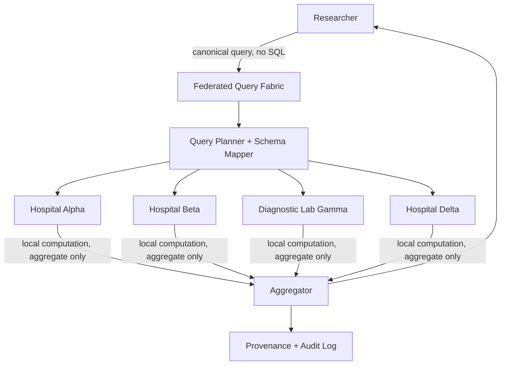

# Federated Clinical Query Fabric

A working prototype of a **federated healthcare analytics platform**. An authorized
researcher submits a clinical question once; four independent institutions each
compute the answer against their own local data; only aggregate, privacy-safe
results are returned. No patient record ever leaves an institution, and no central
patient database exists anywhere in this system.

> **SYNTHETIC DATA — PROTOTYPE ONLY — NOT FOR CLINICAL USE.** See [Limitations](#limitations).

---

## Problem

Healthcare data is fragmented across hospitals, clinics, and labs. Traditional
approaches to multi-site research either (a) physically move patient data into a
central warehouse — a privacy and regulatory liability — or (b) require slow,
manual, institution-by-institution coordination for every question. Neither scales,
and (a) is precisely the pattern this project avoids by design.

## Solution

**Move computation to the data, not the data to the computation.** A researcher
expresses a question as a *canonical clinical query* (diagnosis / medication / lab
value / date filters, combined with AND/OR) — never raw SQL. The federation
translates that canonical query into each institution's own local schema, asks each
institution to compute the answer locally, and combines only the resulting counts.
Failures are never silently treated as zero, small results are suppressed for
privacy, and every result carries a full, tamper-checkable provenance trail.

## Architecture



Each institution's patient-level data (`institutions/{id}/local_data/...` in the
Firestore data model) is only ever read by that institution's own local execution
function. The coordinator (`app.py` + `federated_engine.py`) never fetches, stores,
or forwards raw records — only the small aggregate response
(`{"institution": ..., "status": "SUCCESS", "patient_count": N}`) crosses the
institutional boundary.

## Technology

- **Backend:** Python + Flask + Flask-CORS, REST APIs, Python standard library
  wherever possible. No FastAPI, no SQLAlchemy, no SQLite as primary store.
- **Persistence:** Firebase (Firestore) via the Firebase Admin SDK, with a
  transparent local-file fallback — see [Firebase setup](#firebase-setup--backend-mode).
- **Frontend:** a single-page vanilla JavaScript dashboard (`frontend.html` +
  `styles.css`), served directly by Flask so the whole prototype is reachable from
  one URL. No build step required.
- **Authentication:** Firebase Authentication when available, otherwise a
  clearly-labeled local development auth mechanism — see
  [Authentication](#authentication).

## Data model

Firestore (or its local-fallback equivalent) is organized so that institutional
isolation is structural, not just a convention:

```
users/{user_id}
institutions/{institution_id}
institutions/{institution_id}/local_data/{patient_record}   # never centrally queried
queries/{query_id}
queries/{query_id}/executions/{institution_id}              # aggregate-only per-institution result
provenance/{query_id}
audit_logs/{audit_id}
benchmarks/{benchmark_id}
```

Four institutions participate, each with a genuinely different local schema:

| Institution | Local fields |
|---|---|
| Hospital Alpha | `patient_id, condition_code, medication_name, hba1c, admission_date` |
| Hospital Beta | `person_id, diagnosis, drug_code, lab_hba1c, encounter_date` |
| Diagnostic Lab Gamma | `subject_key, test_code, numeric_value, test_date` |
| Hospital Delta | `record_id, condition, rx, lab_value_hba1c, visit_date` |

Each institution generates several thousand deterministic synthetic records at
startup (`federated_engine.SyntheticDataStore`), so demos are repeatable.

## Query flow

1. Researcher submits a canonical query, e.g. *Type 2 Diabetes AND Metformin AND
   HbA1c > 7*.
2. `federated_engine.validate_canonical_query` validates structure and types.
3. The engine authenticates/authorizes the caller (never trusts a client-supplied
   role).
4. For each institution, the canonical concepts (`E11`, `RX_METFORMIN`,
   `LOINC_4548-4`) are translated into that institution's local codes/fields via
   `TERMINOLOGY` + `SCHEMA_MAPPINGS`-equivalent logic in `_record_matches`.
5. Each institution computes its own local count, applies its own minimum-group-size
   suppression policy, and returns **only** `{status, patient_count | null}`.
6. The engine sums successful counts (never substituting 0 for a failed/timed-out
   node), determines `COMPLETE` vs `INCOMPLETE`, and stores a provenance record and
   audit events.

## Privacy model

What leaves an institution: a status string and, if not suppressed, a single
integer count. What never leaves an institution: patient IDs, names, raw records,
or any field not explicitly part of the aggregate response. `execute_institution_query`
in `federated_engine.py` is the only place local synthetic data is read, and it
returns a plain dict with exactly `institution / status / patient_count /
execution_time_ms / reason` — nothing else.

Institutions with fewer than their configured `minimum_group_size` matching
patients return `SUPPRESSED` with `patient_count: null` rather than an exact small
number. **This is simple minimum-count suppression, not differential privacy** —
see Limitations.

## Authorization

Four roles, enforced server-side on every request via `require_auth(permission)`
in `app.py`:

| Role | Can |
|---|---|
| `RESEARCHER` | Submit queries, view own queries/results, view provenance, view institution status |
| `INSTITUTION_OPERATOR` | View institution status, manage institution (simulate/restore failures) |
| `AUDITOR` | View audit log, view provenance, validate results |
| `ADMIN` | All of the above |

The role used for a request always comes from the **verified** token
(`firebase_config.verify_token`), never from a client-supplied field — the backend
never does `role = request.json["role"]`.

## Authentication

Preferred: Firebase Authentication, verified server-side via
`firebase_admin.auth.verify_id_token`.

**This environment has no network path to Firebase**, so this deployment runs in
**local-fallback mode** (see next section): `firebase_config.py` issues and verifies
a compact, HMAC-SHA256-signed development token (`issue_dev_token` /
`verify_token`), with an expiry and a per-deployment random secret persisted to
`data/.dev_secret`. This is a development-only mechanism, explicitly anticipated by
the project brief for environments without live Firebase access — **it is not
production authentication.**

Demo credentials (development auth only):

| Username | Password | Role |
|---|---|---|
| `researcher1` | `researcher123` | RESEARCHER |
| `operator1` | `operator123` | INSTITUTION_OPERATOR |
| `auditor1` | `auditor123` | AUDITOR |
| `admin1` | `admin123` | ADMIN |

## Failure handling

Every institution execution returns one of `SUCCESS / SUPPRESSED / TIMEOUT / DENIED
/ UNAVAILABLE`. Failed/unreachable nodes are **never** folded into the sum as 0.
When any node doesn't return `SUCCESS` or `SUPPRESSED`, the overall result is marked
`INCOMPLETE` and the response clearly states how many institutions responded — both
in the API payload and in the Execution screen of the UI. Use **Institutions →
Simulate failure** to see this live, then **Restore institution** to bring it back.

## Provenance

Every query gets a unique ID (`Q-<year>-<hex>`), a SHA-256 hash of its canonical
form, and a full record of per-institution status, timing, and the aggregation
method used — stored under `provenance/{query_id}` and viewable in the Provenance
screen.

## Result validation

`FederatedEngine.validate_result` independently re-derives the expected aggregate
from stored per-institution execution records and checks: query hash matches,
execution records exist for every participating institution, failed nodes never
carry a numeric count, the recorded total matches the sum of successful counts, and
the recorded completeness status is correct. Tampering with a stored result (e.g.
editing `final_result` in the data file) will cause validation to fail with the
expected vs. recorded values shown.

## Performance

The Benchmark screen **actually executes** both paths against live synthetic data
on every run (nothing is hard-coded):

- **Federated:** per-institution local computation + small aggregate-only payloads
  leaving each institution.
- **Centralized baseline (benchmark-only):** all institutions' synthetic records
  logically pooled into one in-memory dataset and scanned in a single pass, purely
  to produce a comparison number. **This path is never used to answer real
  queries** — production queries always go through `execute_query`, which is fully
  federated.

Both paths compute the same demo question, so their `final_result` values should
match — a nice built-in sanity check that the federated aggregation is correct.

## Installation

```bash
cd project
pip install flask flask-cors firebase-admin --break-system-packages   # already installed in most environments
```

## Firebase setup / backend mode

To run against real Firebase instead of the local fallback:

```bash
export FIREBASE_SERVICE_ACCOUNT_JSON=/path/to/service-account.json
python app.py
```

If that variable (or `GOOGLE_APPLICATION_CREDENTIALS`) isn't set, or the SDK fails
to initialize, the app automatically falls back to a local, file-backed store with
an identical collection/document interface (`firebase_config.LocalFirestore`), so
the rest of the codebase is unaffected. Check `GET /api/health` — it reports
`backend_mode: "firebase"` or `"local-fallback"`, and the dashboard shows the same.

Never commit or hard-code a service account file or credentials; only reference them
via environment variables.

## Running

```bash
python app.py
```

Then open:

```
http://localhost:5000
```

The whole prototype — dashboard, query builder, execution view, institution
monitor, provenance, audit log, and benchmark — is served from that one URL.

## Demo

1. Sign in as `researcher1` / `researcher123`.
2. **Query Builder** → add diagnosis *Type 2 Diabetes*, medication *Metformin*, lab
   *HbA1c > 7*, logic `AND` → **Execute federated query**.
3. **Execution** screen shows each institution's own count (Lab Gamma is typically
   `SUPPRESSED` — it holds no diagnosis/medication data and its minimum group size
   is 10) and the aggregate total, status `COMPLETE`.
4. Sign out, sign in as `admin1` / `admin123` → **Institutions** → **Simulate
   failure** on Hospital Delta.
5. Sign back in as `researcher1`, run the same query again → Hospital Delta shows
   `TIMEOUT`, the total is now a **partial** sum, and the status is `INCOMPLETE`
   ("3 of 4 institutions responded").
6. As `admin1` or `auditor1`, click **Validate result** — confirms the partial total
   is exactly the sum of the successful nodes and that Delta was never counted as 0.
7. **Institutions** → **Restore institution** on Hospital Delta, then re-run the
   query as `researcher1` → full result returns, `COMPLETE`.
8. **Provenance** shows the full execution flow and query hash for any query.
9. **Audit Log** (as `auditor1` or `admin1`) shows every login, query, node
   execution, validation, and failure-simulation event.
10. **Benchmark** → **Run benchmark** measures live federated vs. centralized
    latency and data-transfer figures against the same demo question.

## Test credentials

See [Authentication](#authentication) above — development-only, used only because
this environment has no live Firebase Authentication access.

## Limitations

This prototype is **not**:

- HIPAA certified
- GDPR certified
- clinically validated
- production-ready
- a replacement for a hospital's own security infrastructure
- a guarantee of privacy
- differential privacy (the minimum-group-size suppression here is a simple count
  threshold, not a formal differential-privacy mechanism)

It is an architectural proof-of-concept demonstrating federated query execution,
schema translation, failure-aware aggregation, provenance, and auditability — not a
deployable clinical system. All patient data in this project is synthetic and
deterministically generated; no real patient data is used or stored anywhere.

## Future improvements

- **FHIR integration** — the canonical query representation here (diagnosis /
  medication / lab / date, ICD-10 / RxNorm-style / LOINC-style codes) is designed to
  map cleanly onto FHIR resources (`Patient`, `Condition`, `MedicationRequest`,
  `Observation`, `Encounter`) without building a full FHIR server today.
- Secure multiparty computation for cross-institution joins
- Formal differential privacy instead of simple count suppression
- Homomorphic encryption for computation over encrypted local data
- Trusted execution environments for institution-side compute
- Production identity federation (SSO/SAML/OIDC across institutions)
- Real hospital system connectors (HL7v2/FHIR API adapters) in place of synthetic
  data generation
